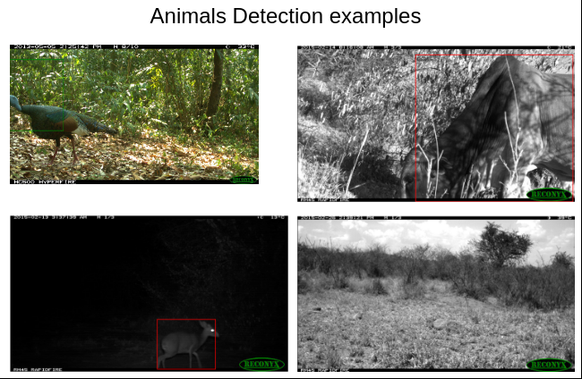
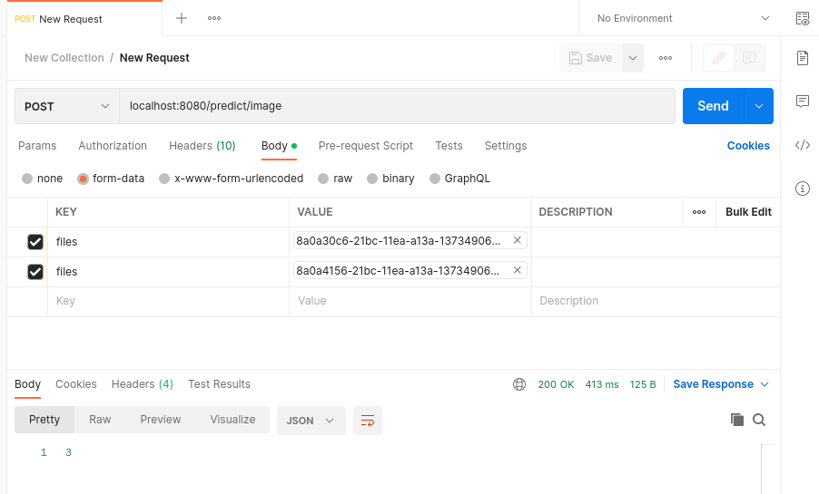

# YOLO based application for object detection
##### We will have a implementaiton of YOLO model and deployment of this model.
Why is it important to control the population of
animals? High number of animals in some area may
lead to habitat abuse, starvation, and death. That is
one of the reasons for ecologists to control population size. Ecologists control density of species
population with use of camera traps. Camera trap
takes a sequence of pictures after it is triggered by
motion nearby. One way Ecologists may evaluate
the number of animals is to analyze this sequence
manually. Alternatively, they may apply an algorithm which will analyze images and predict the
number of animals in given images. Thus, the goal
of this project is to evaluate the number of animals
in a sequence of images taken from Camera Traps.
## Structure
1. In `/app` everything related to service that predict number of animals.
2. In `/analysis` you can find plots and code for running the model to get the plots
3. In `/data` you can store everything related to images and related metadata. For example `processed_test`, `processed_train`, files from kaggle and data which were produced by model.
4. In `model.ipynb` you can find all code related to running the code, preparing the data e.t.c.
5. In `data.yaml` file we store data to use it for training by yolo torch cli
### Application
To start a server run these commands:
```bash
$ docker-compose build
$ docker-compose up
```
### Test using Postman
##### Use the same settings as here.


### Dataset: [Kaggle competition](https://www.kaggle.com/competitions/iwildcam2022-fgvc9/data)
